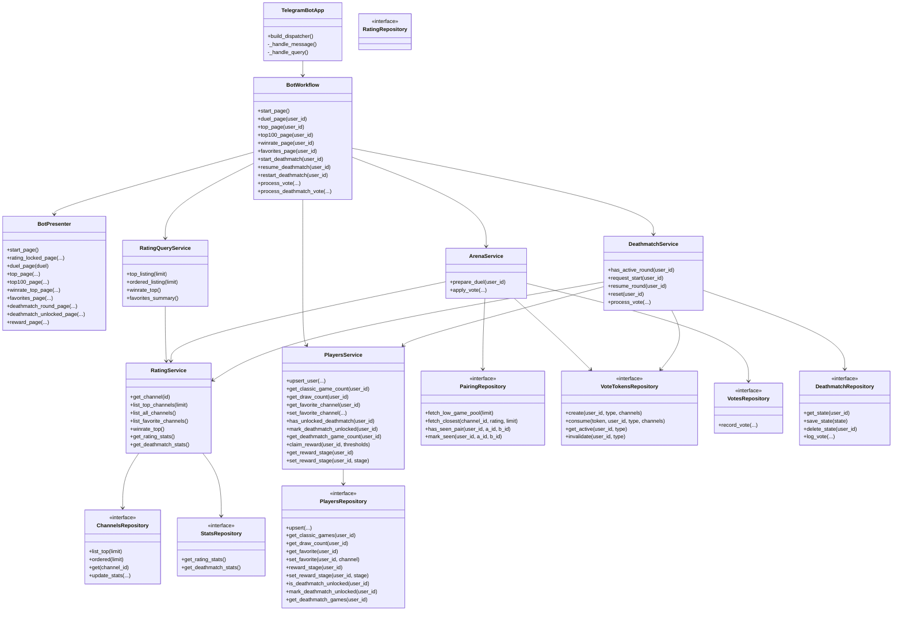

# Диаграмма классов

```mermaid
classDiagram
    class TelegramBotApp {
        +build_dispatcher()
        -_handle_message()
        -_handle_query()
    }
    class BotWorkflow {
        +start_page()
        +duel_page(user_id)
        +top_page(user_id)
        +top100_page(user_id)
        +winrate_page(user_id)
        +favorites_page(user_id)
        +start_deathmatch(user_id)
        +resume_deathmatch(user_id)
        +restart_deathmatch(user_id)
        +process_vote(...)
        +process_deathmatch_vote(...)
    }
    class BotPresenter {
        +start_page()
        +rating_locked_page(...)
        +duel_page(duel)
        +top_page(...)
        +top100_page(...)
        +winrate_top_page(...)
        +favorites_page(...)
        +deathmatch_round_page(...)
        +deathmatch_unlocked_page(...)
        +reward_page(...)
    }
    class RatingQueryService {
        +top_listing(limit)
        +ordered_listing(limit)
        +winrate_top()
        +favorites_summary()
    }
    class RatingService {
        +get_channel(id)
        +list_top_channels(limit)
        +list_all_channels()
        +list_favorite_channels()
        +winrate_top()
        +get_rating_stats()
        +get_deathmatch_stats()
    }
    class PlayersService {
        +upsert_user(...)
        +get_classic_game_count(user_id)
        +get_draw_count(user_id)
        +get_favorite_channel(user_id)
        +set_favorite_channel(...)
        +has_unlocked_deathmatch(user_id)
        +mark_deathmatch_unlocked(user_id)
        +get_deathmatch_game_count(user_id)
        +claim_reward(user_id, thresholds)
        +get_reward_stage(user_id)
        +set_reward_stage(user_id, stage)
    }
    class ArenaService {
        +prepare_duel(user_id)
        +apply_vote(...)
    }
    class DeathmatchService {
        +has_active_round(user_id)
        +request_start(user_id)
        +resume_round(user_id)
        +reset(user_id)
        +process_vote(...)
    }
    class RatingRepository {
        <<interface>>
    }
    class ChannelsRepository {
        <<interface>>
        +list_top(limit)
        +ordered(limit)
        +get(channel_id)
        +update_stats(...)
    }
    class StatsRepository {
        <<interface>>
        +get_rating_stats()
        +get_deathmatch_stats()
    }
    class PlayersRepository {
        <<interface>>
        +upsert(...)
        +get_classic_games(user_id)
        +get_draw_count(user_id)
        +get_favorite(user_id)
        +set_favorite(user_id, channel)
        +reward_stage(user_id)
        +set_reward_stage(user_id, stage)
        +is_deathmatch_unlocked(user_id)
        +mark_deathmatch_unlocked(user_id)
        +get_deathmatch_games(user_id)
    }
    class PairingRepository {
        <<interface>>
        +fetch_low_game_pool(limit)
        +fetch_closest(channel_id, rating, limit)
        +has_seen_pair(user_id, a_id, b_id)
        +mark_seen(user_id, a_id, b_id)
    }
    class VoteTokensRepository {
        <<interface>>
        +create(user_id, type, channels)
        +consume(token, user_id, type, channels)
        +get_active(user_id, type)
        +invalidate(user_id, type)
    }
    class VotesRepository {
        <<interface>>
        +record_vote(...)
    }
    class DeathmatchRepository {
        <<interface>>
        +get_state(user_id)
        +save_state(state)
        +delete_state(user_id)
        +log_vote(...)
    }

    TelegramBotApp --> BotWorkflow
    BotWorkflow --> BotPresenter
    BotWorkflow --> RatingQueryService
    RatingQueryService --> RatingService
    BotWorkflow --> PlayersService
    BotWorkflow --> ArenaService
    BotWorkflow --> DeathmatchService
    ArenaService --> PairingRepository
    ArenaService --> VoteTokensRepository
    ArenaService --> RatingService
    ArenaService --> VotesRepository
    DeathmatchService --> VoteTokensRepository
    DeathmatchService --> DeathmatchRepository
    DeathmatchService --> PlayersService
    DeathmatchService --> RatingService
    RatingService --> ChannelsRepository
    RatingService --> StatsRepository
    PlayersService --> PlayersRepository
```
