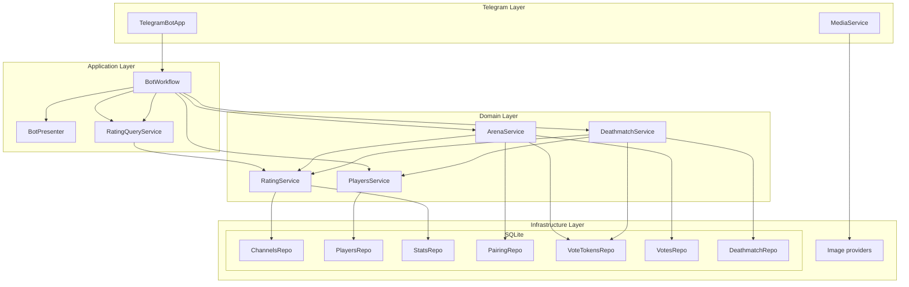

# Диаграмма компонентов

```mermaid
flowchart TB
    subgraph Telegram Layer
        BotApp[TelegramBotApp]
        MediaService
    end

    subgraph Application Layer
        Workflow[BotWorkflow]
        Presenter[BotPresenter]
        RatingQueries[RatingQueryService]
    end

    subgraph Domain Layer
        ArenaService
        DeathmatchService
        RatingService
        PlayersService
    end

    subgraph Infrastructure Layer
        subgraph SQLite
            ChannelsRepo
            PlayersRepo
            StatsRepo
            PairingRepo
            VoteTokensRepo
            VotesRepo
            DeathmatchRepo
        end
        Images[Image providers]
    end

    BotApp --> Workflow
    Workflow --> Presenter
    Workflow --> RatingQueries
    Workflow --> ArenaService
    Workflow --> DeathmatchService
    Workflow --> PlayersService
    Workflow --> RatingQueries
    RatingQueries --> RatingService
    ArenaService --> PairingRepo
    ArenaService --> VoteTokensRepo
    ArenaService --> RatingService
    ArenaService --> VotesRepo
    DeathmatchService --> VoteTokensRepo
    DeathmatchService --> PlayersService
    DeathmatchService --> RatingService
    DeathmatchService --> DeathmatchRepo
    RatingService --> ChannelsRepo
    RatingService --> StatsRepo
    PlayersService --> PlayersRepo
    MediaService --> Images
```
