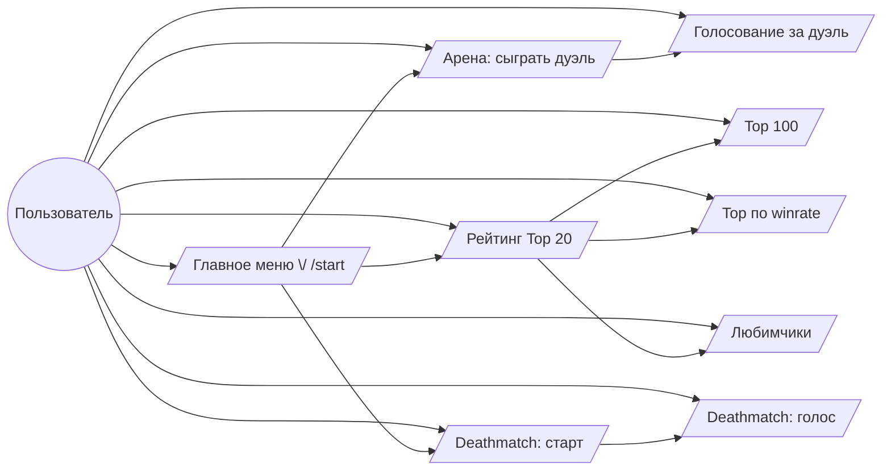

# Use-case Reference

Этот документ описывает ключевые бот-экраны (см. `doc/ui_wireframe.md`), классы, обслуживающие каждый сценарий, и цепочки вызовов от Telegram-слоя до доменных сервисов.

Нотация цепочек: `Class.method → Class.method`. Классы указаны с путями до модуля.

## Диаграмма use-case



---

## 1. Главное меню (`/start`)

**Классы**

- `app/application/bot_app.py:TelegramBotApp` – транспортный слой, принимает `/start`.
- `app/application/workflow.py:BotWorkflow` – оркестратор use-case'ов.
- `app/application/presenters/bot_presenter.py:BotPresenter` – формирует текст и клавиатуру.

**Цепочка**

```
TelegramBotApp._handle_message
  → BotWorkflow.start_page
    → BotPresenter.start_page
  → TelegramBotApp._render_page
```

---

## 2. Классический дуэль (`✅ Арена`)

**Классы**

- `TelegramBotApp` (callback `menu:play`).
- `BotWorkflow.duel_page`.
- `app/domain/arena/services/arena_service.py:ArenaService`.
  - Зависит от `PairingRepository`, `VoteTokensRepository`, `ChannelsRepository`, `VotesRepository`.
- `app/application/media_service.py:MediaService` + `CombinedImageService` (рендер превью).
- `BotPresenter.duel_page`.

**Цепочка**

```
TelegramBotApp._handle_query ("menu:play")
  → BotWorkflow.duel_page(user_id)
    → ArenaService.prepare_duel
      → PairingPolicy.get_pair
      → VoteTokensRepository.create
    → BotPresenter.duel_page(duel)
  → TelegramBotApp._render_page
    → MediaService.build_duel_preview
      → CombinedImageService.build_preview
```

**Голос**

```
Callback vote:* → TelegramBotApp._handle_query
  → BotWorkflow.process_vote(user_id,…,winner)
    → ArenaService.apply_vote
      → VoteTokensRepository.consume
      → ChannelsRepository.get (x2)
      → VotesRepository.record_vote
    → BotWorkflow._maybe_deathmatch_unlock / _maybe_secret_reward
    → BotWorkflow.duel_page (следующий дуэль)
```

---

## 3. Deathmatch (`🔥 Deathmatch`)

**Классы**

- `TelegramBotApp` (callback `menu:deathmatch`, `dmvote:*`, `deathmatch:*`).
- `BotWorkflow.start_deathmatch / resume_deathmatch / restart_deathmatch / process_deathmatch_vote`.
- `app/domain/deathmatch/services/deathmatch_service.py:DeathmatchService`.
  - Работает с `RatingService`, `PlayersService`, `ChannelsRepository`, `DeathmatchRepository`, `VoteTokensRepository`, `Randomizer`.
- `BotPresenter.deathmatch_round_page`, `deathmatch_need_classic_games`, `deathmatch_resume_prompt`, т. д.

**Старт**

```
TelegramBotApp._handle_query ("menu:deathmatch")
  → BotWorkflow.start_deathmatch
    → DeathmatchService.has_active_round
    → DeathmatchService.request_start
      → VoteTokensRepository.invalidate
      → PlayersService.get_classic_game_count
      → RatingService.list_top_channels
      → DeathmatchRepository.save_state
      → VoteTokensRepository.create
    → BotPresenter.(page variant)
```

**Голос за раунд**

```
Callback dmvote:* → BotWorkflow.process_deathmatch_vote
  → DeathmatchService.process_vote
    → VoteTokensRepository.consume
    → DeathmatchRepository.get_state / save_state / delete_state
    → PlayersService.set_favorite_channel (финал)
    → ChannelsRepository.get (за id)
  → BotPresenter.deathmatch_round_page / deathmatch_finished / …
```

---

## 4. Рейтинг Top 20 (`📊 Рейтинг`)

**Классы**

- `BotWorkflow.top_page`.
- `app/application/queries/rating.py:RatingQueryService`.
- `app/domain/rating/services/rating_service.py:RatingService`.
  - Использует `ChannelsRepository`, `StatsRepository`.
- `PlayersService` (для статистики игрока).
- `BotPresenter.top_page` — формирует текст ответа напрямую в presenter.

**Цепочка**

```
Callback "menu:top" → BotWorkflow.top_page(user_id)
  → RatingQueryService.top_listing(limit)
    → RatingService.list_top_channels / get_rating_stats
  → PlayersService.get_classic_game_count / get_draw_count
  → BotPresenter.top_page(listing, player_stats)
```

**Переключения**

- `top:100` → `BotWorkflow.top100_page(user_id)` → `RatingQueryService.ordered_listing`.
- `top:winrate` → `BotWorkflow.winrate_page(user_id)` → `RatingQueryService.winrate_top`.
- `top:favorites` → см. следующую секцию.
- Доступ к любой странице рейтинга предоставляется только после `min_rating_games` классических игр (по умолчанию 10). `BotWorkflow` проверяет счёт через `PlayersService.get_classic_game_count` и возвращает `BotPresenter.rating_locked_page`, если порог не выполнен.

---

## 5. Любимчики / Deathmatch статистика

**Классы**

- `BotWorkflow.favorites_page`.
- `RatingQueryService.favorites_summary`.
- `RatingService.list_favorite_channels` и `RatingService.get_deathmatch_stats`.
- `PlayersService.get_favorite_channel`, `PlayersService.get_deathmatch_game_count`.
- `BotPresenter.favorites_page` — формирует текст экрана любимчиков без отдельных шаблонов.

**Цепочка**

```
Callback "top:favorites"
  → BotWorkflow.favorites_page(user_id)
    → RatingQueryService.favorites_summary
    → PlayersService.get_favorite_channel / get_deathmatch_game_count
    → BotPresenter.favorites_page(summary, favorite,…)
```

---

## 6. Разблокировка Deathmatch

**Классы**

- `BotWorkflow._maybe_deathmatch_unlock`.
- `PlayersService.has_unlocked_deathmatch / mark_deathmatch_unlocked / get_classic_game_count`.
- `BotPresenter.deathmatch_unlocked_page`.

**Цепочка**

```
После успешного ArenaService.apply_vote →
  BotWorkflow._maybe_deathmatch_unlock
    → PlayersService.has_unlocked_deathmatch
    → PlayersService.get_classic_game_count
    → PlayersService.mark_deathmatch_unlocked
    → BotPresenter.deathmatch_unlocked_page
```

---

## 7. Секретный подарок (350/700 игр)

**Классы**

- `BotWorkflow._maybe_secret_reward`.
- `PlayersService.claim_reward` (использует `RewardThreshold`).
- `BotPresenter.reward_page`.

**Цепочка**

```
BotWorkflow.process_vote → _maybe_secret_reward
  → PlayersService.claim_reward
    → PlayersService.get_reward_stage / set_reward_stage
    → PlayersService.get_classic_game_count
  → BotPresenter.reward_page
```

---

## 8. Вспомогательные сценарии

| Ситуация | Классы | Цепочка |
| --- | --- | --- |
| Недостаточно каналов / пустая база | `BotWorkflow.duel_page` / `start_deathmatch`, `BotPresenter.duel_unavailable` | проверка репозиториев → presenter |
| Повторное нажатие токена | `ArenaService.apply_vote` / `DeathmatchService.process_vote`, `BotPresenter.duplicate_*` | токен не валиден → presenter |
| Устаревший deathmatch | `DeathmatchService.resume_round` / `process_vote` | отсутствие state/token → `BotPresenter.deathmatch_state_missing` |

---

## Диаграмма зависимостей (текстовая)

- **Transport**: `TelegramBotApp` зависит от `BotWorkflow`, `MediaService`, `BotPresenter`.
- **Application**: `BotWorkflow` зависит от `ArenaService`, `DeathmatchService`, `PlayersService`, `RatingQueryService`, `BotPresenter`.
- **Queries**: `RatingQueryService` зависит от `RatingService`.
- **Domain services**:
  - `ArenaService` → `PairingRepository`, `ChannelsRepository`, `VoteTokensRepository`, `VotesRepository`.
  - `DeathmatchService` → `RatingService`, `PlayersService`, `ChannelsRepository`, `DeathmatchRepository`, `VoteTokensRepository`, `Randomizer`.
  - `PlayersService` → `PlayersRepository`.
  - `RatingService` → `ChannelsRepository`, `StatsRepository`.
- **Infrastructure**: реализаций (SQLite, image provider, randomizer) подменяет `AppContainer`.

Эти цепочки охватывают все экраны, перечисленные в wireframe, и показывают, какие классы и методы участвуют в каждом пользовательском действии.
